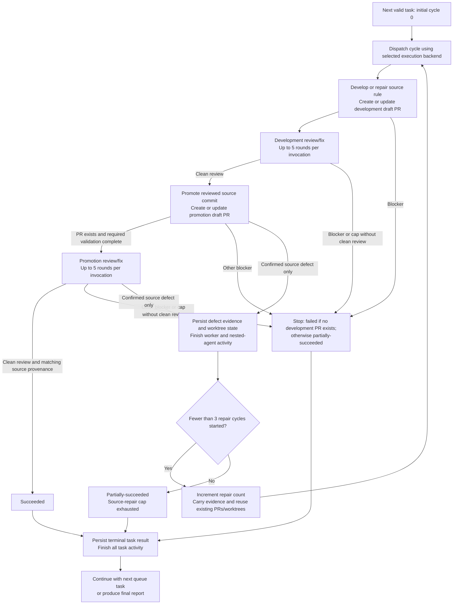

# Develop lintdiff rules one by one

Run a queue of prepared lintdiff worker commands sequentially. Each command is
an independent task. Each task cycle runs:

`development -> development review -> promotion -> promotion review`

Only a clean development review permits promotion. A confirmed source-rule
defect found during promotion or promotion review returns the task to development
with the defect evidence. Allow the initial cycle plus at most three source-repair
cycles, for at most four complete cycles. Finish the current task, including any
repair cycles, before starting the next rule. Never have more than one top-level
worker running at a time.

Select the [execution backend](app-session-execution.md) before dispatch.
In an explicit-target environment, each cycle gets a fresh top-level
general-purpose subagent as described below. When PR creation is bound to an
app session, use the app-session procedure instead: development and promotion
run sequentially in their separate owning sessions, with the outer queue
coordinating phase handoffs. A directory change in a subagent is not a new
publication context. The backend changes execution ownership, not the four
phases, review requirements, or repair budgets.

Each review-and-fix invocation creates its own two persistent nested subagents.
Those nested subagents are allowed and do not violate the one-top-level-worker
limit. Each invocation retains its independent five-round limit; do not share
that budget across PRs or cycles.

## Workflow

The graph shows one valid queue task after complete-queue validation. Invalid
entries are recorded as failed without launching a worker.



## Required input

Accept one command per non-empty input line. Every command must:

- start with `/develop-lintdiff-rule --worker`
- name exactly one rule
- include exactly one `--typespec-worktree <absolute-path>`
- include exactly one `--specs-worktree <absolute-path>`
- include exactly one `--target-branch feature/lintdiff-migration-new`
- contain no other flags or positional arguments

Treat quoted arguments as one value. Ignore Markdown code-fence lines and blank
lines, but otherwise preserve each command verbatim for the worker. Reject
duplicate options even when one occurrence has the required value.

Publication bindings are orchestration metadata, not input command lines or
additional flags. The dispatcher must provide a separate commands-only block
for queue invocation. In app-session mode the queue can discover the owner
from each exact TypeSpec worktree path even when no binding metadata was pasted.
Do not relax malformed-line rejection to accept arbitrary handoff prose.

Validate the complete queue before launching the first subagent. Record malformed
lines as failed tasks and continue with every valid command. Compare rule IDs
case-insensitively after normalizing them to a stable key while preserving their
original casing for display. Compare Windows worktree paths case-insensitively
after resolving them to normalized absolute paths. The first occurrence of a
rule ID, TypeSpec worktree, or specs worktree may remain valid; mark every later
queue entry that reuses any of them as failed. Do not ask the user to repair
malformed input during the run.

As part of complete-queue validation, read
`packages/typespec-lintdiff/catalog/validator-rule-metadata.json` as a JSON array
and match each rule by its rule-ID field case-insensitively. Mark a missing or
`DataPlane`-only rule as failed before launching a worker; only `ARM` and `Both`
are eligible for `/develop-lintdiff-rule`. Record the observed applicability as
the blocker. This is a read-only eligibility check, not target synchronization
or worktree verification.

## Queue state

Keep an ordered ledger with one entry per input command:

- 1-based task number
- rule ID
- original command
- TypeSpec and specs worktrees
- promotion worktree and branch, once selected
- execution backend and development/promotion publication bindings: project and
  owning session IDs when applicable, worktree, repository, base, and head branch
- phase dispatch ID, owning session ID, cycle, expected head, and whether a
  dispatched phase is awaiting a result; retain completed dispatch IDs
- absolute log path
- status: `pending`, `running`, `succeeded`, `partially-succeeded`, or `failed`
- development and promotion draft PR URLs, when created, with their verified
  repository, base, head branch, and head SHA
- development, development-review, promotion, and promotion-review results,
  including completed review rounds, termination reason, and reviewed head SHA
- cycle number (`0` for initial development, `1` through `3` for source repair),
  source-repair count, and each cycle's fresh worker ID or app-session phase
  dispatch IDs
- immutable source commit used for each promotion attempt
- append-only cycle history, including source-repair evidence, prior results,
  PR identities, worktree state manifests, and final head states
- high-confidence process-improvement suggestions, each with the proposed
  change, observed evidence, impact, and source task
- total worker attempt count, separate orchestration-retry count and reason,
  and source-repair reasons
- blocker or failure, when applicable

Update the ledger after every phase handoff and worker result so a later failure
does not erase earlier outcomes. `source-repair-required` is a worker outcome,
not a terminal task status: keep the task `running` while a permitted repair
cycle is pending. Never count repair cycles as additional queue tasks.

## Sequential orchestration

After complete input and eligibility validation, perform the read-only
[publication preflight](app-session-execution.md#preflight-and-existing-worktrees)
for all valid entries. This checks session metadata and tool capabilities, not
Git synchronization or dependency readiness. Persist failures before launching
development. Do not spend a full development run discovering that the caller
cannot publish its branch.

For session-bound publication, follow
[app-session execution](app-session-execution.md#queue-execution) rather than
launching a cycle subagent with the full worker prompt below. That procedure
defines phase-scoped prompts, unattended notifications, and session reuse.
The following subagent launch/wait procedure applies only to the explicit-target
backend. Common logging, result classification, review and repair rules still
apply to both backends.

For each valid pending command, in input order:

1. Launch exactly one fresh top-level general-purpose subagent. Do not reuse a
   prior worker with a follow-up message.
2. Give it the complete worker prompt below, including the original command and
   parsed TypeSpec worktree, cycle number, and cycle handoff when resuming.
3. Wait for that subagent to finish before launching another top-level subagent.
   Do not start, prepare, or speculatively inspect a later task while it runs.
4. Record its structured result in the ledger. Verify returned PR identities,
   pushed heads, source provenance, and review evidence directly rather than
   inferring success from worker prose.
5. For `source-repair-required`, apply the bounded source-repair loop below.
   Launch a fresh worker for the same task only after the prior worker is
   terminal and its nested agents and commands have stopped doing work.
6. Once the task is terminal, continue with the next task even if this task
   failed or only partially succeeded.

Use background mode for a worker when the runtime requires multiple turns for a
long-running development and review workflow. After its completion notification,
read its result once, update the ledger, and only then launch the next worker.
Use sync mode only when the complete workflow can realistically finish within
that invocation.

At worker launch, report the active task, cycle number, TypeSpec worktree,
promotion worktree when known, and `log.txt` path.
If the user requests status while the worker is running, read the latest
heartbeat and report its timestamp, phase, active command, elapsed time, and
last completed milestone. Do not launch another worker or duplicate the active
command merely to obtain status.

## Bounded orchestration retry

This setup-only retry is distinct from the source-repair loop below. Allow at
most one orchestration retry for the entire task, not one per cycle, and use a
fresh top-level subagent for the explicit-target backend. App-session execution
uses a new phase dispatch in the same verified owner, never another concurrent
session on the same branch.
Retry only when the first attempt proves an unambiguous defect in this outer
skill's command parsing, worker prompt, worktree selection, log initialization,
or skill-invocation mechanics before `/develop-lintdiff-rule` begins repository
or dependency work.

Before retrying, verify all of the following:

- the TypeSpec and specs worktrees have no task changes
- no task commit was created or pushed
- no pull request was created
- the proposed orchestration-skill correction is narrow and directly addresses
  the recorded failure

Apply the narrow correction outside the rule worktrees, record the original
failure and correction in the ledger, then launch one fresh worker with the
corrected prompt. Never reuse the failed worker.

Do not retry dependency, build, validation, corpus, review, network, credential,
push, or GitHub failures automatically. An orchestration retry is forbidden after
development changed files, created a commit, pushed a branch, or created a pull
request. Only a confirmed source defect under the separate source-repair contract
permits restarting after development work. If the orchestration retry fails,
record the task's terminal result and continue the queue.

## Bounded source-repair loop

Invoking this queue authorizes the following handoff without another user
confirmation. It does not authorize a promotion worker or promotion-review fix
agent to repair the source in place.

1. Accept `source-repair-required` only from promotion creation or promotion PR
   review, backed by a verified defect in the pinned lintdiff source. A review
   comment, failing command, uncertain finding, or adaptation-only defect is not
   sufficient. Require the evidence fields in the cycle handoff below. An
   operational blocker remains terminal even when accompanied by a source defect;
   do not use source repair to retry a failed network, validation, or publication
   operation. A regression that demonstrably fails because of the confirmed
   source semantics is defect evidence, not an operational validation failure;
   distinguish it from compiler, harness, dependency, or command failures.
2. Persist the completed cycle and evidence before deciding to restart. If three
   source-repair cycles have already started, stop as `partially-succeeded` with
   `source-repair-cap-exhausted` and the remaining defect. There is no fourth
   repair cycle, including for a newly discovered defect.
3. Otherwise increment the repair count and launch a fresh top-level worker with
   the original command verbatim plus the complete cycle handoff as context, not
   extra command-line flags. This authorized reuse is within the same queue
   entry; it does not relax duplicate-input rejection.
   In app-session execution, dispatch a new development phase in the recorded
   development session instead; return to the recorded promotion session only
   after the new development head has a clean review. Retaining session
   ownership is required and does not authorize reusing review subagents.
4. Restart at `/develop-lintdiff-rule`, not at promotion. Reuse the original
   TypeSpec/specs worktrees, source branch, and development PR. Preserve commits
   and add focused repair commits. Re-establish evidence, add regression
   coverage, complete required validation and migration evidence, then run a new
   development review loop. No prior clean review covers a changed source head.
5. Only after clean development review, promote from that exact reviewed and
   pushed source commit. Reuse the recorded promotion worktree, branch, and PR
   when present; create the PR only if it does not yet exist. Apply the source
   repair and necessary native adaptations as incremental promotion changes,
   refresh provenance and fixture-to-native mappings, validate, and run a new
   promotion review loop. Do not merge or cherry-pick the entire development
   branch into the promotion branch.
6. Repeat only for another confirmed source defect. Never close or replace an
   existing PR, force-push, reset, or rebase to manufacture a fresh cycle. If a
   recorded PR is closed/merged, its branch identity changed, or its head/worktree
   state no longer matches the handoff, stop and report the blocker.

Keep development PRs on their existing
`feature/lintdiff-migration-new` target. Promotion follows its skill's existing
same-repository `Azure/typespec-azure`/`main` target and agent-recommended
destination, with new rules disabled by default. Do not wait for or perform a
development merge before promotion, and never merge either PR automatically.

## Cycle handoff

Pass this structured context to each delegated skill as applicable and to every
fresh repair worker. It is an orchestration contract, not a new public CLI flag:

- queue ownership marker `lintdiff-development-queue`, task number, exact rule
  ID, original command, cycle number, and source-repair count
- execution backend, phase dispatch ID and phase scope, both publication
  bindings when known, coordinator session ID, and instruction-version paths
- absolute TypeSpec/specs worktrees, source branch, canonical development PR
  URL, repository/base/head identities, and last verified pushed source SHA
- canonical promotion PR URL when created, promotion worktree and branch when
  selected, repository/base/head identities, last pushed promotion SHA, and
  pinned source SHA for that promotion attempt
- selected destination package, official rule name, ruleset enablement decision,
  and existing promotion adaptations that must be preserved on refresh
- all completed phase outcomes, review-round counts, reviewed SHAs, and previous
  repair reasons; do not overwrite earlier results when a later cycle fails
- source defect evidence: discovery phase, exact source paths and locations,
  source SHA, expected versus actual behavior, reproducer or regression case,
  technical explanation of why this is a source defect rather than promotion
  adaptation, and relevant review/comment IDs when available
- explicit repair scope and acceptance criteria, preserving all still-relevant
  unresolved source findings across cycles
- absolute shared execution-log path and durable artifact paths for handoff
  evidence; no secrets or generated corpus payloads
- worktree state manifest at handoff: branch/HEAD, tracked/staged/untracked
  task-owned paths, their diffs and content hashes, and the completed actions
  establishing ownership of any unfinished edits

Record `not created`/`not run` with a reason for unavailable phase fields; never
invent a PR, worktree, source SHA, or clean-review result. Missing or unverifiable
repair evidence is a blocker, not permission to restart.
Refresh current head identities after each verified task-owned push while retaining
the previous SHAs in cycle history. Compare against the latest recorded state,
not the cycle's initial SHA, when handing off to the next phase. On the first
cycle, source-defect fields are `not applicable`; they become mandatory only for
a source-repair request.

Promotion may stop before PR creation with unfinished task-owned edits. Preserve
them and record the manifest outside tracked repository files. The next promotion
invocation may resume them only after verifying exact state and ownership; no
blanket clean, stash, reset, overwrite, or speculative checkpoint commit is
allowed. Unrelated, unexplained, or externally changed files stop the task.
This exception applies only to queue-controlled promotion preparation/resumption:
promotion PR review still requires a clean worktree at the verified pushed head.
Keep all earlier review agents idle/finished before source repair or promotion
refresh begins; never reuse them across review-loop invocations.

## Top-level worker prompt

For the explicit-target backend, give each top-level subagent all of these
instructions. App-session execution uses the
[phase-scoped owner prompts](app-session-execution.md#phase-scoped-owner-prompts)
instead, retaining these logging and evidence requirements without instructing
one session to execute both publication phases.

> You own exactly one cycle of one lintdiff rule task. Your cycle is
> `<cycle-number>`; the initial cycle is `0` and repair cycles are `1` through `3`.
> Read the supplied cycle handoff before acting. Work autonomously and do not ask the
> user or parent agent any questions. Make reasonable decisions from repository
> evidence. If a concrete blocker cannot be resolved safely, return the blocker
> instead of waiting for input.
>
> Your TypeSpec worktree is `<typespec-worktree>`. Begin by changing your working
> directory to that exact path and verify that it is the repository root. Run
> all TypeSpec repository and GitHub operations from that worktree unless an
> invoked skill explicitly requires the supplied specs worktree or the recorded
> promotion worktree. Never perform promotion edits in the source worktree.
>
> Maintain an append-only execution log at `<typespec-worktree>\log.txt` for the
> entire task. Before making repository changes, resolve the worktree's exclude
> file with `git rev-parse --git-path info/exclude`, add the root-relative
> `/log.txt` entry if it is not already present, then create or append to the
> log. Verify with `git check-ignore log.txt` that Git ignores the file. This
> resolution is required because `.git` can be a file in a linked worktree.
> Never stage or commit `log.txt`. If the log cannot be created, appended, or
> verified as ignored, stop and return the blocker. The outer queue classifies
> the task as failed or partial according to whether a development PR exists.
>
> Write a timestamped entry at task start and after every material action. Log
> shell commands before running them, their meaningful stdout and stderr, exit
> status, delegated-skill milestones, validation outcomes, commits, pushes, PR
> creation, review rounds, applied or rejected findings, blockers, and the final
> task outcome. Append entries as work progresses so the user can inspect the
> file while the task is running; do not wait until the end to write it. Never
> write credentials, tokens, authorization headers, or other secrets to the log.
> Reuse this same absolute log through promotion and every repair cycle; do not
> truncate it or create a new per-cycle log. Include cycle, phase, and working
> directory in entries, and instruct delegated agents to log their milestones.
>
> At every phase transition, append a `HEARTBEAT` entry containing the phase,
> active command, elapsed time, and last completed milestone. During an operation
> expected to exceed 10 minutes, run it in a form that permits monitoring and
> append another heartbeat at least every 10 minutes until it ends.
>
> Do not fetch, pull, merge, rebase, or reset the target or rule branch before
> invoking `/develop-lintdiff-rule`. That delegated skill exclusively owns
> worktree cleanliness checks, target-branch fetching, remote-base verification,
> and any safe fast-forward of an untouched rule branch.
>
> Next invoke this skill command verbatim as a slash-command/skill invocation,
> not as a shell command:
>
> `<original-command>`
>
> Follow `/develop-lintdiff-rule` through draft pull-request creation, or update
> the existing development PR during source repair. Pass the repair evidence and
> existing PR identity as invocation context without changing the original command.
> Do not stop after implementation, validation, commit, or push. Capture the canonical
> development PR URL and pushed head. Pass the shared post-run policy's queue ownership
> constraint to that skill: do not modify skills or create a skill-update PR;
> return only evidence-backed, high-confidence suggestions to the outer agent.
> Maintain the cycle handoff after every phase, preserving prior heads in history
> and recording newly verified pushed heads before calling the next skill.
>
> After the draft PR exists, invoke:
>
> `/loop-for-fix-and-review <canonical-development-pr-url>`
>
> Complete that skill's bounded review-and-fix loop. It may create the two nested
> persistent subagents required by its own contract. Pass the same queue
> ownership constraint to that skill and its subagents. Retain only
> evidence-backed, high-confidence process suggestions for your result.
>
> Stop this cycle if development or its review is blocked or reaches the review
> cap without clean verification. Do not proceed to promotion. A successful
> review must meet the review skill's verified no-comments/no-valid-comments
> termination condition at the current pushed head.
>
> After clean development review, invoke:
>
> `/lintdiff-rule-promote <rule-id>`
>
> Supply the queue marker and cycle handoff, exact reviewed source SHA, source
> worktree and development PR URL, and existing promotion worktree/branch/PR
> identities when resuming. Source repair is authorized only after this skill
> stops and returns evidence to the outer queue. Source remains immutable during
> promotion. Do not ask for destination confirmation; keep existing destination
> and ruleset enablement unless the evidence requires reporting a blocker.
> Pass the same no-skill-edits/no-skill-update-PR ownership constraint.
>
> Follow promotion through draft PR creation or update. Record the absolute
> promotion worktree and canonical promotion PR URL. A confirmed source defect
> returns `source-repair-required` with the complete cycle handoff immediately;
> do not repair the source yourself or launch the next cycle. Other blockers
> stop this cycle and do not request repair.
>
> After a promotion PR exists and required promotion validation is complete,
> invoke from its recorded worktree:
>
> `/loop-for-fix-and-review <canonical-promotion-pr-url>`
>
> Pass the queue marker, cycle handoff, immutable reviewed source commit, and
> the same ownership constraint to this skill and its two new persistent nested
> agents. Complete its independent bounded loop in promotion PR mode. Source
> defects found in either the unresolved backlog or a new review return
> `source-repair-required`; never fix source semantics only in the promoted copy.
> Caps, uncertain findings, and operational failures stop this cycle.
>
> Before returning, ensure no delegated agent or command is still mutating the
> worktrees or running this cycle's workflow. Do not modify any delegated skill.
> Do not start another cycle or another rule.
> Return a structured result containing rule ID, cycle, all four phase outcomes,
> both canonical PR URLs and verified final head states when available, review
> termination reasons and completed-round counts for each invocation, source SHA,
> absolute source and promotion worktrees, the shared absolute `log.txt` path,
> and any blocker. For `source-repair-required`, include all cycle-handoff evidence
> and any unfinished task-owned promotion state. Return each
> high-confidence process-improvement suggestion with four fields: proposed
> change, concrete observed evidence, impact, and source task. Do not ask the
> user about suggestions or include low-confidence suggestions.

The outer agent exclusively owns the consolidated post-run review and any
skill-update PR under the shared policy. This does not override safety stops,
validation requirements, review-loop limits, or repository guardrails.

## Result classification

Classify a task as:

- `succeeded` only when both draft PRs exist, both review loops reached a clean
  successful termination condition on their current pushed heads, and promotion
  provenance matches the final reviewed source commit
- `partially-succeeded` when a development PR exists but the complete workflow
  cannot finish, including promotion blockers, either review cap, failed repair,
  or exhaustion of the three-source-repair budget
- `failed` when input validation, branch synchronization, or rule development
  failed before a development draft PR was created

Do not describe a task as fully successful merely because it created one or both
PRs. A later failed repair does not erase the earlier PR or clean review history,
but that history cannot establish success for newer, unreviewed heads. Report a
required-validation blocker even if the promotion skill returned a draft PR.

## Final result

After every queue entry is terminal, output the heading
`# LintDiff development results`, followed by this totals line:

`**Completed:** <total> | **Succeeded:** <count> | **Partial:** <count> | **Failed:** <count>`

Then report every task in input order using this layout:

````markdown
## <task-number>. <rule-id> - <status>

**TypeSpec worktree**

```text
<absolute-typespec-worktree>
```

**Development pull request:** <canonical-development-pr-url-or-Not-created>

**Development review:** <latest-result-and-round-count-or-reason-not-run>

**Promotion worktree**

```text
<absolute-promotion-worktree-or-Not-available>
```

**Promotion pull request:** <canonical-promotion-pr-url-or-Not-created>

**Promotion review:** <latest-result-and-round-count-or-reason-not-run>

**Source-repair cycles:** <started-count>/3

**Execution log**

```text
<absolute-typespec-worktree>\log.txt
```

**Blocker:** <blocker-if-any>
````

Put each TypeSpec and promotion worktree in its own standalone `text` code block with no
prompt, label, `code -n`, or other command on the same line. This lets the user
copy the folder path directly. Do the same for the execution-log path. Omit the
`Blocker` line when there is no blocker. For malformed input whose worktree
cannot be parsed, use `Not available` for its TypeSpec and log paths. Use
`Not available` for a promotion worktree that was never created or selected.
Keep existing PR links and promotion paths visible even when a later repair fails.
Distinguish earlier successful reviews from phases not rerun in the latest cycle.

Never omit failed input lines or stop the final report at the first failure.
After the task sections, include the skill-update PR link and brief summary, or
a publishing blocker, only when required by the shared policy's final handoff.
Do not print a process-suggestions list or low-confidence observations.

## Post-run process review

After every queue entry is terminal, briefly review the complete run before the
final user response. Read and follow the
[shared post-run process review](../shared/post-run-process-review.md), including
its confidence gate, ownership, independent PR, and reporting rules. This review
belongs to the outer agent; workers only return qualifying evidence.

Capture concrete suggestions for improving future queue runs, especially:

- command parsing, validation, deduplication, and malformed-input reporting
- worktree preflight, fixed-target synchronization, and branch safety
- worker prompts or delegated-skill handoffs that were missing or ambiguous
- background completion, queue-state persistence, failure continuation, and
  evidence that only one top-level worker ran at a time
- `log.txt` completeness, readability, secret avoidance, and usefulness while
  a worker was still running
- PR URL capture, source-SHA pinning, and all four phase transitions
- source-defect classification, repair-budget accounting, and evidence handoffs
- safe reuse of PRs/worktrees and preservation of unfinished promotion edits
- status classifications or summary details that made results hard to interpret
- copyability of TypeSpec worktree and execution-log paths
- repeated setup or validation work that could be avoided safely on later tasks
- skill instructions that should be corrected or clarified based on the run

## Guardrails

- Never launch two top-level workers concurrently.
- In app-session execution, never have development and promotion owners doing
  task work simultaneously, or call the session-bound creation tool from the
  outer queue or its subagents. Retain owning sessions across repair cycles;
  do not reuse them for a different rule.
- Never launch the next worker until the previous worker is terminal.
- Never reuse a completed worker for another command.
- Never ask the user a question during queue execution.
- Reject any command whose `--target-branch` is not exactly
  `feature/lintdiff-migration-new`.
- Reject duplicate or unknown arguments and later queue entries that reuse a
  rule ID, TypeSpec worktree, or specs worktree.
- Leave target synchronization and worktree verification exclusively to
  `/develop-lintdiff-rule`; the outer worker must not mutate Git state first.
- Never exceed one setup-only orchestration retry or three source-repair cycles.
  Do not apply orchestration retry after development begins or reinterpret
  operational failures as source defects.
- Never promote without clean development review, or report success without
  clean promotion review against the final source provenance.
- Never let promotion or its review mutate the source; return evidence to the
  outer queue for a fresh repair worker.
- Never run a slash command as a PowerShell or shell executable.
- Never stage, commit, or push a worker's `log.txt`.
- Never infer success from subagent prose when the PR or pushed head can be
  verified directly.
- Workers must never edit skills or create skill-update PRs based on post-run
  suggestions.
- The outer agent may make high-confidence post-run skill updates only through
  the shared policy's independent skill-only PR after the queue has ended.
