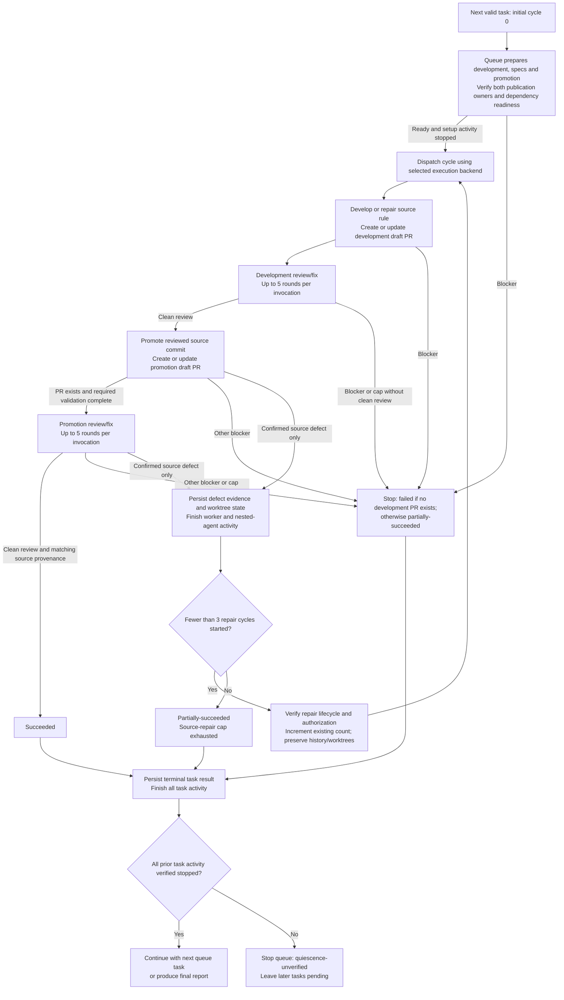

# Develop lintdiff rules one by one

Run a queue of rule IDs or prepared lintdiff worker commands sequentially. Each
rule is an independent task. The queue owns
[workspace preparation](preparation.md): create/verify development, specs and
promotion worktrees, both publication owners, and dependency readiness before
starting that rule. Each task cycle then runs:

`development -> development review -> promotion -> promotion review`

The coordinator may run from an unrelated folder. Its cwd, branch and app
project are not defaults for task work or publication. Resolve the target
repository and authoritative instructions through the shared
[coordinator and folder scope](preparation.md#coordinator-and-folder-scope).
All task worktrees must be inside the selected worktrees folder.

Only a clean development review permits promotion. A confirmed source-rule
defect found during promotion or promotion review returns the task to development
with the defect evidence. Allow the initial cycle plus at most three source-repair
cycles, for at most four complete cycles. Finish the current task, including any
repair cycles, before starting the next rule. Never have more than one top-level
worker running at a time.

Select the [execution backend](app-session-execution.md) before dispatch.
In an explicit-target environment, each cycle gets a fresh top-level
general-purpose subagent as described below. When PR creation is bound to an
app session, use the app-session procedure instead: development and promotion
run sequentially in their separate owning sessions, with the outer queue
coordinating phase handoffs. A directory change in a subagent is not a new
publication context. The backend changes execution ownership, not the four
phases, review requirements, or repair budgets.

Each review-and-fix invocation creates its own two persistent review/fix agents.
The phase owner normally owns them; when nested launch controls are unavailable,
the outer queue owns the review phase using the capability handoff below. These
two agents do not violate the one-top-level-worker limit. Each invocation retains
its independent five-round limit; do not share that budget across PRs or cycles.

## Workflow

The graph shows one valid queue task after complete-queue validation. Invalid
entries are recorded as failed without launching a worker.



## Required input

Accept the optional queue-level argument `--worktrees-folder <absolute-path>`.
When omitted, use `C:\dev\worktrees`, independently of the coordinator's cwd.
Accept `C:/dev/worktrees` as the same Windows path and normalize to backslashes.
The option applies to the entire queue, including existing paths in supplied
worker commands, repair cycles, review agents and auxiliary task worktrees.

Parse this option once, before entry validation, from rule-ID lines or a
standalone option line. It may precede or follow rule IDs on that line. Quoted
paths with spaces are one argument. Reject duplicate options (even equal values),
missing/empty values, relative or drive-relative paths, unresolved variables,
wildcards and unknown queue options before any setup. Do not expand shell text.
A malformed queue option blocks the invocation; do not run entries under a
guessed/default folder. An option-only invocation has no tasks and must not
prepare resources.

Do not extract this option from a `/develop-lintdiff-rule --worker` line:
that line retains its strict grammar below. For prepared-command input, place
`--worktrees-folder` on its own line outside the worker commands. Pass the
resolved folder to subskills as handoff metadata, not as a new worker flag.

```text
/do-linter-development-task-one-by-one TagsAreNotAllowedForProxyResources
/do-linter-development-task-one-by-one --worktrees-folder "D:\lint worktrees" TagsAreNotAllowedForProxyResources
```

These are alternative invocations, not a two-entry queue.

Accept either input form, ignoring blank lines and Markdown code-fence lines:

- **Rule IDs (preferred):** one or more whitespace-separated catalog validator
  IDs, on one or more lines after removing the queue-level option. Each token is
  a queue entry. No other flags, commas or handoff prose. The target is fixed to
  `feature/lintdiff-migration-new`.
- **Prepared worker commands (compatibility/resumption):** one complete command
  per non-empty line.

Every prepared worker command must:

- start with `/develop-lintdiff-rule --worker`
- name exactly one rule
- include exactly one `--typespec-worktree <absolute-path>`
- include exactly one `--specs-worktree <absolute-path>`
- include exactly one `--target-branch feature/lintdiff-migration-new`
- contain no other flags or positional arguments

For example, `/do-linter-development-task-one-by-one ParametersInPointGet PatchBodyParametersSchema`
prepares and completes the first rule before preparing the second.

Determine the form for each line before parsing: a line beginning with
`/develop-lintdiff-rule` is a command candidate and must satisfy the entire
command grammar; never reinterpret its malformed arguments as rule IDs. Other
lines are rule-ID candidates whose tokens must individually match the catalog.
Mixed queues are allowed and preserve input order. Treat quoted command
arguments as one value and preserve supplied commands verbatim. Reject duplicate
options even when one occurrence has the required value. Never execute input as
shell text. Invalid command lines count as one failed entry; invalid rule-ID
tokens count as individual failed entries.

Publication bindings are orchestration metadata, not input command lines or
additional flags. A standalone dispatcher must provide a separate commands-only block
for queue invocation. In app-session mode the queue can discover the owner
from each exact TypeSpec worktree path even when no binding metadata was pasted.
Do not relax malformed-line rejection to accept arbitrary handoff prose.

Keep explicit task authorizations in a separate
[recovery context](../shared/recovery-context.md), never in the strict worker
command. In particular, post-merge source repair is opt-in, not implied by a
generic queue invocation. Preserve approved validation settings and exact
existing-fork exceptions across phases without repeatedly requesting approval.

Validate the complete queue before preparation or launching the first subagent. Record malformed
lines as failed tasks and continue with every valid command. Compare rule IDs
case-insensitively after normalizing them to a stable key while preserving their
original casing for display. Compare Windows worktree paths case-insensitively
after resolving them to normalized absolute paths. The first occurrence of a
rule ID, TypeSpec worktree, or specs worktree may remain valid; mark every later
queue entry that reuses any of them as failed. Do not ask the user to repair
malformed input during the run. Paths absent from rule-ID input are selected
during preparation; perform cross-role path and owner collision checks again
before any setup mutation in those paths.
Reject an entry whose supplied or discovered task worktree falls outside the
selected folder under the shared physical-containment check. Do not rewrite its
path, move its checkout or silently widen the folder to make it eligible.

For rule-ID input, generate the effective worker command only after actual paths
are known, quoting paths with spaces. Persist it alongside the original input;
use it unchanged in every cycle. For supplied commands, the effective command is
the original command. In the worker prompts and repair protocol below,
`original-command` means this persisted effective worker command, never a bare
rule ID or reconstructed command with changed paths.

As part of complete-queue validation, read
`packages/typespec-lintdiff/catalog/validator-rule-metadata.json` as a JSON array
from the explicitly resolved target repository, not the coordinator's cwd,
and match each rule by its rule-ID field case-insensitively. Mark a missing or
`DataPlane`-only rule as failed before launching a worker; only `ARM` and `Both`
are eligible for `/develop-lintdiff-rule`. Record the observed applicability as
the blocker. This is a read-only eligibility check, not target synchronization
or worktree verification.

## Queue state

Keep an ordered ledger with one entry per parsed queue entry:

- 1-based task number
- rule ID
- original input, input form and effective worker command (once prepared)
- resolved `worktrees_folder`, target repository root/project, authoritative
  instruction source and canonical/physical containment evidence for every path
- TypeSpec and specs worktrees
- promotion worktree and branch, selected during preparation
- preparation phase/status, durable readiness manifest and instruction-version
  hashes, setup dispatches/results, dependency fingerprints and invalidations
- execution backend and development/promotion publication bindings: project and
  owning session IDs when applicable, worktree, repository, base, and head branch
- publication operation for each phase (`create` or `update-existing`), exact
  existing PR identity when applicable and supported folder-placement capability
- phase dispatch ID, owning session ID, cycle, expected head, and whether a
  dispatched phase is awaiting a result; retain completed dispatch IDs
- absolute log path
- status: `pending`, `running`, `succeeded`, `partially-succeeded`, or `failed`
- development and promotion draft PR URLs, when created, with their verified
  repository, base, head branch, and head SHA
- development, development-review, promotion, and promotion-review results,
  including completed review rounds, termination reason, and reviewed head SHA
- cycle number (`0` for initial development, `1` through `3` for source repair),
  source-repair count, and each cycle's fresh worker ID or app-session phase
  dispatch IDs
- immutable source commit used for each promotion attempt
- append-only cycle history, including source-repair evidence, prior results,
  PR identities, worktree state manifests, and final head states
- high-confidence process-improvement suggestions, each with the proposed
  change, observed evidence, impact, and source task
- total worker attempt count, separate orchestration-retry count and reason,
  and source-repair reasons
- review owner (`worker` or `outer`), observed launch/follow-up capabilities,
  waiting phase, handoff artifact, and review invocation/agent IDs
- local draft-correction counts, causal evidence and rerun results, separate
  from worker attempts, review rounds and source-repair cycles
- native-test timeout-diagnosis usage (at most one per task across all phases
  and cycles), eligibility evidence, concurrency change and full-scope results
- predeclared required/supplemental validation plan, authority and per-command
  disposition; disclosed limitations and read-only blocker-reconciliation decisions
- publication attempt/error identities, exact base/head tuple and SHA, absence
  query evidence, and the separate one-correction publication budget
- original readiness/status/quiescence deadlines, last genuine progress,
  status-request identity and evidence that previous task activity stopped
- explicit recovery authorizations, including the user message, named failure,
  additional attempt allowance and usage, and any legacy-worktree adoption binding
- recovery-context artifact/content identity, scoped validation profiles,
  `legacy_fork_update`, `post_merge_source_repair`, `active_source_pr`, and
  append-only `source_pr_history` for an authorized publication rollover
- blocker or failure, when applicable

Update the ledger after every phase handoff and worker result so a later failure
does not erase earlier outcomes. `source-repair-required` is a worker outcome,
not a terminal task status: keep the task `running` while a permitted repair
cycle is pending. Never count repair cycles as additional queue tasks.
Likewise, `review-handoff` is a nonterminal worker outcome: keep the task
`running` while the outer queue owns that review phase.

## Sequential orchestration

After complete input and eligibility validation, perform the read-only
[publication preflight](app-session-execution.md#preflight-and-existing-worktrees)
for supplied bindings and existing-worktree commands, and check backend/review
capabilities for every valid entry. New rule-ID entries do not yet have owner
bindings; do not reject them merely because preparation has not created owners.
Persist known failures before development.

For each remaining entry in input order, complete the queue-owned
[preparation phase](preparation.md) for all three resources. Both development
and promotion publication bindings, completion channels and required dependency
profiles must be ready before launching development. Prepare only the current
task; keep later tasks pending until its work is terminal and quiescent.
Compatibility input reuses its exact development/specs paths and adds/verifies
the promotion resource; it never silently replaces an unbound legacy checkout.
Preparation is not repeated for repair cycles: revalidate the retained manifest
and repair only invalidated layers. An opted-in post-merge transition requires
a new source-creation binding, not a new dependency installation or new task.
Record setup failures and preserve resources.

For session-bound publication, follow
[app-session execution](app-session-execution.md#queue-execution) rather than
launching a cycle subagent with the full worker prompt below. That procedure
defines phase-scoped prompts, unattended notifications, and session reuse.
The following subagent launch/wait procedure applies only to the explicit-target
backend. Common logging, result classification, review and repair rules still
apply to both backends.

For each successfully prepared command, in input order:

1. Launch exactly one fresh top-level general-purpose subagent per cycle. Do not
   reuse a worker from a prior task or cycle. Follow-up messages to the same
   idle worker are allowed only for capability coordination or continuation
   after an outer-owned review, an approved bounded resumption, or a verified
   read-only blocker reconciliation in this cycle. None starts a fresh cycle.
2. Give it the complete worker prompt below, including the original command and
   parsed TypeSpec worktree, cycle number, and cycle handoff when resuming.
3. Wait for that subagent to finish before launching another top-level subagent.
   Do not start, prepare, or speculatively inspect a later task while it runs.
4. Record its structured result in the ledger. Verify returned PR identities,
   pushed heads, source provenance, and review evidence directly rather than
   inferring success from worker prose.
   For `review-handoff`, complete the outer-owned review protocol below before
   resuming the same worker or declaring the task terminal.
   Before accepting any terminal blocker, apply the shared
   [read-only reconciliation](../shared/recovery-context.md#read-only-blocker-reconciliation).
   A `policy-reconciliation-handoff` remains nonterminal while this one
   adjudication runs; it does not authorize another command attempt.
5. For `source-repair-required`, apply the bounded source-repair loop below.
   Launch a fresh worker for the same task only after the prior worker is
   terminal and its nested agents and commands have stopped doing work.
6. Once the task is terminal AND all its owner/nested-agent/command activity is
   verified stopped, continue with the next task even if this task failed or
   only partially succeeded. Follow the shared
   [finite reconciliation and quiescence gate](app-session-execution.md#completion-delivery-and-reconciliation).
   If quiescence cannot be established, stop the queue with later entries
   pending; a timeout is not permission to overlap owners.

Use background mode for a worker when the runtime requires multiple turns for a
long-running development and review workflow. After its completion notification,
read its result once and update the ledger. An idle `review-handoff` worker has
not completed its cycle; handle the review before launching the next worker.
Use sync mode only when the complete workflow can realistically finish within
that invocation.

At worker launch, report the active task, cycle number, TypeSpec worktree,
promotion worktree when known, and `log.txt` path.
If the user requests status while the worker is running, read the latest
heartbeat and report its timestamp, phase, active command, elapsed time, and
last completed milestone. Do not launch another worker or duplicate the active
command merely to obtain status.

### Review capability preflight and handoff

Do not assume that a worker inherits the outer agent's tools. Before launching
it, inspect the outer agent's exposed tools for background/persistent launch and
follow-up messaging and pass the observed capabilities in the worker prompt.
Require the worker to inspect its own exposed schema before development starts.
Do not invent unsupported tool arguments or require speculative GitHub requests
to probe capabilities. Tool exposure is only the routing preflight; the selected
review owner must still verify actual persistent-agent follow-ups during review
initialization.

- Select `worker` when the worker can launch and message persistent agents.
- Select `outer` when the worker cannot but the outer agent can. Explicit-target
  whole-cycle workers require same-worker follow-up; app-session phase owners
  require session handoff/result delivery, not continuation into another
  publication phase. Record capabilities and selection for each phase owner.
- If neither route is available, stop before repository/dependency/publication
  work and report an orchestration capability blocker, not a source-rule defect.
  Do not substitute synchronous reviewers or reuse agents from earlier loops.

For `outer` mode:

Outer ownership applies only to the post-publication GitHub review-and-fix loop.
It does not waive the development or promotion skill's independent local
precommit review. Complete that local review and its validation gates before
publication; if the worker cannot arrange it, hand the unpublished diff and
evidence to the outer agent for that review before requesting publication.

1. The worker completes development, records the canonical PR, pushed SHA,
   applicable validation evidence and exact worktree state, then returns
   `review-handoff` with `phase: development-review`. It remains idle; no worker
   command or nested agent may keep acting on either worktree. Use the structured
   return and durable handoff artifact when direct parent messaging is unavailable;
   do not assume an inherited session ID identifies a distinct parent.
2. The outer queue verifies that handoff and invokes `/loop-for-fix-and-review`
   itself, from the recorded target worktree. It creates a fresh persistent
   collector/fixer pair, retains the fixer's model pin, independently verifies
   evidence and authorizes publication exactly as that skill requires. The
   development worker does not serve as either reviewer or fixer. Append review
   milestones to the same log and retain the independent five-round budget,
   backlog handling, validation gates and all stop conditions.
3. On clean review, record the final pushed and reviewed SHA and ensure both
   review agents and their commands are idle/finished. In explicit-target mode,
   send the result and updated cycle handoff to the same whole-cycle worker,
   which rechecks identities and proceeds to promotion from that exact commit.
   In app-session mode, keep the development owner idle and reverify the
   DISTINCT promotion owner already recorded during preparation; dispatch
   that owner with the reviewed source SHA. Never resume the development owner
   into promotion or create the source PR from the coordinator. Neither route
   consumes a worker retry or permits concurrent mutation.
4. After promotion publication and required validation, the applicable worker
   or app promotion owner returns
   another `review-handoff` with `phase: promotion-review`, including the
   promotion worktree and immutable source provenance. The outer queue runs a
   separate review invocation with a new persistent pair. It may finalize the
   task directly once this review and final provenance verification are complete.
5. A review blocker or exhausted cap ends the task; do not resume the worker to
   bypass it. A confirmed promotion source defect follows the existing bounded
   source-repair protocol only after all prior activity ends: a fresh whole-cycle
   worker for explicit-target mode, or the retained development/promotion owners
   with new phase dispatch IDs for app-session mode.
   Missing/unverifiable handoff state is a blocker, not a clean review.

This route must be selected before review side effects. It does not permit
retrying an already-failed review under another owner, resetting review budgets,
or converting operational failures into source-repair cycles. Explicit
user-authorized restarts preserve the earlier failed run in history and reverify
reused progress; they are not automatic retries.

## Bounded orchestration retry

This setup-only retry is distinct from the source-repair loop below. Allow at
most one orchestration retry for the entire task, not one per cycle, and use a
fresh top-level subagent for the explicit-target backend. App-session execution
uses a new phase dispatch in the same verified owner, never another concurrent
session on the same branch.
Retry only when the first attempt proves an unambiguous defect in this outer
skill's command parsing, worker prompt, worktree selection, log initialization,
or skill-invocation mechanics before rule work begins. It may correct a dispatch
of an already-successfully-prepared bundle, but must reuse that exact verified
bundle without replaying preparation. Failed provisioning, synchronization,
installation or build operations are not setup-only routing defects and cannot
be retried under this exception.

Before retrying, verify all of the following:

- every already-selected development, specs and promotion worktree has no task changes
- no task commit was created or pushed
- no pull request was created
- the proposed orchestration-skill correction is narrow and directly addresses
  the recorded failure

Apply the narrow correction outside the rule worktrees, record the original
failure and correction in the ledger, then launch one fresh worker with the
corrected prompt. Never reuse the failed worker.

Do not restart workers automatically for dependency, build, validation, corpus,
review, network, credential, push or GitHub failures. First apply the recorded
[validation gate levels](../shared/recovery-context.md#validation-gates-and-supplemental-checks):
continuing after a disclosed supplemental limitation is not a worker restart
or command retry. This does not prohibit an
eligible in-place draft correction, the single
[native-test timeout diagnosis](#native-test-timeout-diagnosis) below, or the shared
[single evidenced publication-configuration correction](app-session-execution.md#publication-recovery).
That exception requires positive exact-PR absence and a specific proven defect,
uses only the required creation tool, and never restarts a worker or retries
unknown transport/API failures. Track it separately from every other budget.
An orchestration retry is forbidden
after task-owned tracked edits (including dependency-manifest repair), a commit,
push or PR. Only a confirmed source defect under the separate source-repair
contract permits an automatic cycle restart after development work. If the
orchestration retry fails, record the task's terminal result and continue only
after verified quiescence.

### Local draft correction is not a worker restart

Apply the review skill's
[bounded draft-correction policy](../loop-for-fix-and-review/SKILL.md#bounded-draft-correction)
to agent-introduced errors in unpublished task-owned changes or validation
commands. Review phases use that skill's three-attempt budget per backlog pass
or round. Development and
promotion preparation each allow three corrective attempts per phase per cycle
under the same causal-evidence, scope, rerun and stop requirements. Track these
budgets separately; returning to a phase does not reset its count.
Agent-introduced setup draft/command mistakes debit that same phase's cycle-0
allowance (specs setup belongs to development); starting development or promotion
does not grant a fresh allowance. Initial installation of a verified missing
prerequisite is normal preparation, not a corrective retry. Provisioning,
credential, network and other external failures remain outside draft correction.

The active worker or fix agent corrects eligible compiler, lint, test, semantic
regression or deterministic invocation failures in place and reruns the original
intended required checks. Command corrections share the existing three-attempt
budget and require verified argument semantics, validation population and
side-effect safety; they are not worker restarts or external-operation retries.
It must not report a terminal blocker merely because its own draft needs a safe,
understood correction and budget remains. Preserve all failed-attempt evidence;
do not restart the worker, consume a source-repair cycle, or weaken validation.
Except for the narrowly eligible native-test timeout diagnosis below,
external/indeterminate operational failures, unknown causes, exhausted budgets
and confirmed immutable promotion-source defects retain their existing
stop/handoff behavior.

### Native-test timeout diagnosis

Select the applicable [validation profile](../shared/recovery-context.md#reusable-validation-profiles)
before the initial test run and carry it across handoffs. An existing approved
hook setting is not a new diagnostic allowance. Do not silently revert it to
defaults, expand its scope, or increase it after a failure.

Apply the review skill's
[bounded native-test timeout diagnosis](../loop-for-fix-and-review/SKILL.md#bounded-native-test-timeout-diagnosis)
to completed native unit-test runs with only per-test timeout failures.
The queue invocation authorizes at most one such diagnostic rerun per task,
shared across development, promotion, nested reviews, and source-repair cycles.
The outer queue verifies eligibility and records usage before dispatching the
same phase owner or fix agent; it does not restart a worker. Preserve the
original failure, test population, skip set, and configured timeouts.
If the owner cannot obtain approval within its current turn, return a
nonterminal `timeout-diagnosis-handoff` with all commands stopped and the
eligibility evidence. Keep the task `running` while the outer queue evaluates
and dispatches this allowance; a rejected handoff returns to the normal stop
policy. This same-owner continuation does not consume an orchestration retry.

This is not permission to retry a corpus, build, hung command, assertion failure,
or external operation. If the allowance is used or eligibility is unproven,
retain the existing stop policy. A subsequent understood draft defect uses the
remaining draft-correction budget, never a fresh diagnostic allowance.

### Explicitly authorized bounded resumption

After a terminal stop, a user may explicitly authorize recovery of a named
deterministic draft/command failure with a finite additional correction allowance.
A generic queue invocation, "continue", or pasted failure history is not such
authorization. This is not an automatic retry or a new source-repair cycle.

1. Record the authorization text, failed command/evidence, task/cycle/phase,
   preserved state manifest, and exact additional allowance before doing work.
   Keep the original exhausted counter unchanged; track supplemental attempts
   separately (for example, original `3/3`, user-authorized `0/1`).
2. Reverify file ownership, content hashes, index/worktree state, PR identities
   and publication bindings. For an explicitly authorized legacy checkout,
   follow [legacy-worktree adoption](app-session-execution.md#authorized-legacy-worktree-adoption).
   Do not discard, recreate, or overwrite unfinished work to satisfy preflight.
3. Confirm the same causal and side-effect evidence required by bounded draft
   correction. Limit the correction to the authorized failure. For a CLI error,
   read the installed command's help or implementation before execution; do not
   invent flags. Count the supplemental attempt before running its correction.
4. Rerun the failed check at its intended scope, then complete remaining required
   work and checks invalidated by the correction. Reuse earlier evidence only
   when matching content and applicable requirements establish its validity.
   Success resumes the normal phase, publication and review gates; a new failure
   outside the authorization, or exhausted supplemental allowance, stops it.
5. Preserve the original terminal result, all failures and passing reruns.
   Do not reset other budgets, reinterpret an operational error as a source
   defect, retry uncertain publication/network operations, waive validation,
   or reuse an old review for a changed head. Each resumed review invocation
   still requires a fresh persistent pair and the existing publication gates.

The authorization is handoff metadata, not a new worker CLI flag. Pass it to
the phase owner; the outer queue must not run promotion commands as a substitute
for establishing the correct owning session. Skill changes requested as part of
recovery must finish before starting a new review loop, not during one.

## Bounded source-repair loop

Invoking this queue authorizes the following handoff without another user
confirmation. It does not authorize a promotion worker or promotion-review fix
agent to repair the source in place.

1. Accept `source-repair-required` only from promotion creation or promotion PR
   review, backed by a verified defect in the pinned lintdiff source. A review
   comment, failing command, uncertain finding, or adaptation-only defect is not
   sufficient. Require the evidence fields in the cycle handoff below. An
   operational blocker remains terminal even when accompanied by a source defect;
   do not use source repair to retry a failed network, validation, or publication
   operation. A regression that demonstrably fails because of the confirmed
   source semantics is defect evidence, not an operational validation failure;
   distinguish it from compiler, harness, dependency, or command failures.
2. Persist the completed cycle and evidence before deciding to restart. If three
   source-repair cycles have already started, stop as `partially-succeeded` with
   `source-repair-cap-exhausted` and the remaining defect. There is no fourth
   repair cycle, including for a newly discovered defect.
3. Otherwise verify the recorded source PR lifecycle before dispatch. Reuse an
   OPEN source PR. For MERGED source PRs, require and complete the shared
   [opt-in transition](../shared/recovery-context.md#opt-in-post-merge-source-repair);
   without that authorization stop. CLOSED-without-merge remains a blocker.
   Increment the existing repair count when launching a fresh top-level worker with
   the original command verbatim plus the complete cycle handoff as context, not
   extra command-line flags. This authorized reuse is within the same queue
   entry; it does not relax duplicate-input rejection.
   In app-session execution, dispatch a new development phase in the recorded
   development session instead; return to the recorded promotion session only
   after the new development head has a clean review. Retaining session
   ownership is required and does not authorize reusing review subagents.
4. Restart at `/develop-lintdiff-rule`, not at promotion. Reuse the original
   TypeSpec/specs worktrees and the active source publication binding. Reuse the
   source branch/PR when OPEN; only the authorized post-merge transition may
   introduce a successor branch/PR, retaining the predecessor in history. Preserve commits
   and add focused repair commits. Re-establish evidence, add regression
   coverage, complete required validation and migration evidence, then run a new
   development review loop. No prior clean review covers a changed source head.
5. Only after clean development review, promote from that exact reviewed and
   pushed source commit. Reuse the recorded promotion worktree, branch, and PR
   when present; create the PR only if it does not yet exist. Apply the source
   repair and necessary native adaptations as incremental promotion changes,
   refresh provenance and fixture-to-native mappings, validate, and run a new
   promotion review loop. Do not merge or cherry-pick the entire development
   branch into the promotion branch.
6. Repeat only for another confirmed source defect. Never close or replace an
   existing PR, force-push, reset, or rebase to manufacture a fresh cycle. A
   merged-source successor is allowed only under the opt-in transition; it
   never resets budgets or replaces historical results. A closed-without-merge
   source PR, closed/merged promotion PR, unexplained branch identity change,
   or head/worktree mismatch still stops the task.

Keep development PRs on their existing
`feature/lintdiff-migration-new` target. Promotion follows its skill's canonical
`Azure/typespec-azure`/`main` base, recorded head-repository policy and agent-recommended
destination, with new rules disabled by default. Do not wait for or perform a
development merge before promotion, and never merge either PR automatically.

## Cycle handoff

Pass this structured context to each delegated skill as applicable and to every
fresh repair worker. It is an orchestration contract, not a new public CLI flag:

- queue ownership marker `lintdiff-development-queue`, task number, exact rule
  ID, original command, cycle number, and source-repair count
- recovery context/content identity, acknowledged authorizations and validation
  profiles, active source PR and predecessor history; include the verified
  new-creation binding when an opted-in merged-source successor is needed
- execution backend, phase dispatch ID and phase scope, both verified publication
  bindings, coordinator session ID, readiness manifest and instruction-version
  paths/hashes acknowledged by the owner
- resolved worktrees folder, target repository root/project, physical path
  containment and each phase's `create`/`update-existing` publication operation
- absolute TypeSpec/specs worktrees, source branch, canonical development PR
  URL, repository/base/head identities, and last verified pushed source SHA
- canonical promotion PR URL when created, promotion worktree and branch when
  selected, repository/base/head identities, last pushed promotion SHA, and
  pinned source SHA for that promotion attempt
- selected destination package, official rule name, ruleset enablement decision,
  and existing promotion adaptations that must be preserved on refresh
- all completed phase outcomes, review-round counts, reviewed SHAs, and previous
  repair reasons; do not overwrite earlier results when a later cycle fails
- task-wide native-test timeout-diagnosis allowance and usage, including failed
  and passing evidence; no phase or source-repair cycle receives a new allowance
- source defect evidence: discovery phase, exact source paths and locations,
  source SHA, expected versus actual behavior, reproducer or regression case,
  technical explanation of why this is a source defect rather than promotion
  adaptation, and relevant review/comment IDs when available
- explicit repair scope and acceptance criteria, preserving all still-relevant
  unresolved source findings across cycles
- absolute shared execution-log path and durable artifact paths for handoff
  evidence; no secrets or generated corpus payloads
- review owner and capability evidence, pending review phase, review invocation
  and agent IDs, and verified result when returning from an outer-owned review
- worktree state manifest at handoff: branch/HEAD, tracked/staged/untracked
  task-owned paths, their diffs and content hashes, and the completed actions
  establishing ownership of any unfinished edits

Record `not created`/`not run` with a reason for unavailable phase fields; never
invent a PR, worktree, source SHA, or clean-review result. Missing or unverifiable
repair evidence is a blocker, not permission to restart.
Refresh current head identities after each verified task-owned push while retaining
the previous SHAs in cycle history. Compare against the latest recorded state,
not the cycle's initial SHA, when handing off to the next phase. On the first
cycle, source-defect fields are `not applicable`; they become mandatory only for
a source-repair request.

Promotion may stop before PR creation with unfinished task-owned edits. Preserve
them and record the manifest outside tracked repository files. The next promotion
invocation may resume them only after verifying exact state and ownership; no
blanket clean, stash, reset, overwrite, or speculative checkpoint commit is
allowed. Unrelated, unexplained, or externally changed files stop the task.
This exception applies only to queue-controlled promotion preparation/resumption:
promotion PR review still requires a clean worktree at the verified pushed head.
Keep all earlier review agents idle/finished before source repair or promotion
refresh begins; never reuse them across review-loop invocations.

## Top-level worker prompt

For the explicit-target backend, give each top-level subagent all of these
instructions. App-session execution uses the
[phase-scoped owner prompts](app-session-execution.md#phase-scoped-owner-prompts)
instead, retaining these logging and evidence requirements without instructing
one session to execute both publication phases.

> You own exactly one cycle of one lintdiff rule task. Your cycle is
> `<cycle-number>`; the initial cycle is `0` and repair cycles are `1` through `3`.
> Read the supplied cycle handoff before acting. Work autonomously and do not ask the
> user or parent agent any questions. Make reasonable decisions from repository
> evidence. If a concrete blocker cannot be resolved safely, return the blocker
> instead of waiting for input.
>
> Your TypeSpec worktree is `<typespec-worktree>`. In EVERY shell call, explicitly
> select the intended absolute path with terminating error handling and verify
> that it is the repository root before commands run; directory and environment
> changes do not persist across PowerShell calls. Run
> all TypeSpec repository and GitHub operations from that worktree unless an
> invoked skill explicitly requires the supplied specs worktree or the recorded
> promotion worktree. Use absolute file paths. Never perform promotion edits in
> the source worktree. A directory change does not alter publication ownership;
> this full-cycle prompt is valid only for the explicit-target backend.
> All task worktrees must remain under `<worktrees-folder>`, including review,
> repair and auxiliary worktrees. Apply the shared physical-containment check
> before mutations; never use the coordinator's cwd or an out-of-folder checkout
> as a fallback. Existing PR operations explicitly name the verified PR; new
> creation must use the selected worktree's verified publication binding.
>
> Before development, inspect your exposed tools and select the review owner
> using the supplied outer capabilities and the review capability preflight
> above. Report the selected route in the handoff. If nested persistent launch is
> unavailable but the outer route is available, do not declare the task blocked:
> return `review-handoff` at each review boundary and remain idle until continued.
> A structured return is sufficient; no parent-message tool is required.
>
> Maintain an append-only execution log at `<typespec-worktree>\log.txt` for the
> entire task. Before making repository changes, resolve the worktree's exclude
> file with `git rev-parse --git-path info/exclude`, add the root-relative
> `/log.txt` entry if it is not already present, then create or append to the
> log. Verify with `git check-ignore log.txt` that Git ignores the file. This
> resolution is required because `.git` can be a file in a linked worktree.
> Never stage or commit `log.txt`. If the log cannot be created, appended, or
> verified as ignored, stop and return the blocker. The outer queue classifies
> the task as failed or partial according to whether a development PR exists.
>
> Write a timestamped entry at task start and after every material action. Log
> shell commands before running them, their meaningful stdout and stderr, exit
> status, delegated-skill milestones, validation outcomes, commits, pushes, PR
> creation, review rounds, applied or rejected findings, blockers, and the final
> task outcome. Append entries as work progresses so the user can inspect the
> file while the task is running; do not wait until the end to write it. Never
> write credentials, tokens, authorization headers, or other secrets to the log.
> Reuse this same absolute log through promotion and every repair cycle; do not
> truncate it or create a new per-cycle log. Include cycle, phase, and working
> directory in entries, and instruct delegated agents to log their milestones.
> Keep long-running command output in a separate durable artifact and append
> shared-log entries with short-lived writes. Do not pipe an entire long-running
> command through `Tee-Object` to the shared log: it can hold the file open and
> prevent the parent or heartbeat monitor from appending. Preserve the command's
> exit status independently of logging and record its raw-output artifact path.
>
> At every phase transition, append a `HEARTBEAT` entry containing the phase,
> active command, elapsed time, and last completed milestone. During an operation
> expected to exceed 10 minutes, run it in a form that permits monitoring and
> append another heartbeat at least every 10 minutes until it ends.
>
> For agent-introduced draft or validation-command errors, apply the local
> draft-correction policy above. Record the causal evidence and attempt count, correct eligible failures
> in place, and rerun the failed required command plus affected remaining checks.
> For an eligible completed native-test timeout-only failure, report the evidence
> and inherited task-wide allowance to the outer queue for the single diagnostic
> rerun. Do not consume it independently or treat it as a new worker/cycle.
> Do not stop merely on the first build/test failure in your own draft or a
> safely correctable invocation mistake. Confirm command semantics and side
> effects, preserve the intended scope and count the correction. Do stop
> on ineligible required-check failures or when a needed correction has exhausted
> its recovery budget, and never
> publish a draft with a failed required gate or task defect. Record required
> versus supplemental commands before execution and follow the shared
> validation-disposition contract; do not turn an optional broad failure into
> a required gate. If policy application is unclear, return
> `policy-reconciliation-handoff` with all commands stopped and exact evidence,
> rather than requesting another retry or declaring a terminal failure yourself.
>
> The queue has already prepared all three worktrees and publication bindings.
> Read and verify the preparation manifest and supplied instruction versions.
> Acknowledge the task-scoped recovery context before commands. Reuse exact
> applicable fork-update permissions and validation profiles; do not infer new
> authorization, reset counters, or independently roll over a merged source PR.
> Do not recreate worktrees, rerun dispatcher mode or repeat passing dependency
> setup. The development skill revalidates the prepared state and may repair only
> invalidated layers under the shared preparation contract. Never pull, reset,
> rebase or move a target branch as an ad hoc setup fix.
>
> Next invoke this skill command verbatim as a slash-command/skill invocation,
> not as a shell command:
>
> `<original-command>`
>
> Follow `/develop-lintdiff-rule` through draft pull-request creation, or update
> the active development PR during source repair (or create the explicitly
> authorized post-merge successor). Pass the repair evidence and
> existing PR identity as invocation context without changing the original command.
> Do not stop after implementation, validation, commit, or push. Capture the canonical
> development PR URL and pushed head. Pass the shared post-run policy's queue ownership
> constraint to that skill: do not modify skills or create a skill-update PR;
> return only evidence-backed, high-confidence suggestions to the outer agent.
> Maintain the cycle handoff after every phase, preserving prior heads in history
> and recording newly verified pushed heads before calling the next skill.
>
> After the draft PR exists, in worker-owned review mode invoke:
>
> `/loop-for-fix-and-review <canonical-development-pr-url>`
>
> Complete that skill's bounded review-and-fix loop. It may create the two nested
> persistent subagents required by its own contract. Pass the same queue
> ownership constraint to that skill and its subagents. Retain only
> evidence-backed, high-confidence process suggestions for your result.
>
> In outer-owned mode, instead persist the complete development review handoff,
> return `review-handoff`, and end this turn with no work still running. Do not
> invoke the GitHub review-loop skill or start promotion yourself. The required
> independent local precommit review still precedes publication in both phases.
> Resume this same cycle
> only after the outer agent supplies a verified clean review result and updated
> pushed source SHA. Recheck that identity before promotion.
>
> Stop this cycle if development or its review is blocked or reaches the review
> cap without clean verification. Do not proceed to promotion. A successful
> review must meet the review skill's verified no-comments/no-valid-comments
> termination condition at the current pushed head.
>
> After clean development review, invoke:
>
> `/lintdiff-rule-promote <rule-id>`
>
> Supply the queue marker and cycle handoff, exact reviewed source SHA, source
> worktree and development PR URL, the already-prepared promotion worktree/branch
> and readiness manifest, plus its PR identity when present. Never defer promotion
> owner selection until this phase. Source repair is authorized only after this skill
> stops and returns evidence to the outer queue. Source remains immutable during
> promotion. Do not ask for destination confirmation; keep existing destination
> and ruleset enablement unless the evidence requires reporting a blocker.
> Pass the same no-skill-edits/no-skill-update-PR ownership constraint.
>
> Follow promotion through draft PR creation or update. Record the absolute
> promotion worktree and canonical promotion PR URL. A confirmed source defect
> returns `source-repair-required` with the complete cycle handoff immediately;
> do not repair the source yourself or launch the next cycle. Other blockers
> stop this cycle and do not request repair.
>
> After a promotion PR exists and required promotion validation is complete, in
> worker-owned review mode invoke from its recorded worktree:
>
> `/loop-for-fix-and-review <canonical-promotion-pr-url>`
>
> Pass the queue marker, cycle handoff, immutable reviewed source commit, and
> the same ownership constraint to this skill and its two new persistent nested
> agents. Complete its independent bounded loop in promotion PR mode. Source
> defects found in either the unresolved backlog or a new review return
> `source-repair-required`; never fix source semantics only in the promoted copy.
> Caps, uncertain findings, and operational failures stop this cycle.
>
> In outer-owned mode, instead persist the complete promotion review handoff
> with source provenance, return `review-handoff`, and remain idle. Do not claim
> success before the outer queue completes that review and final verification.
>
> Before returning, ensure no delegated agent or command is still mutating the
> worktrees or running this cycle's workflow. Do not modify any delegated skill.
> Do not start another cycle or another rule.
> Return a structured result containing rule ID, cycle, all four phase outcomes,
> both canonical PR URLs and verified final head states when available, review
> termination reasons and completed-round counts for each invocation, source SHA,
> absolute source and promotion worktrees, the shared absolute `log.txt` path,
> and any blocker. For `source-repair-required`, include all cycle-handoff evidence
> and any unfinished task-owned promotion state. Return each
> high-confidence process-improvement suggestion with four fields: proposed
> change, concrete observed evidence, impact, and source task. Do not ask the
> user about suggestions or include low-confidence suggestions.

The outer agent exclusively owns the consolidated post-run review and any
skill-update PR under the shared policy. This does not override safety stops,
validation requirements, review-loop limits, or repository guardrails.

## Result classification

Classify a task as:

- `succeeded` only when both draft PRs exist, both review loops reached a clean
  successful termination condition on their current pushed heads, and promotion
  provenance matches the final reviewed source commit
- `partially-succeeded` when a development PR exists but the complete workflow
  cannot finish, including promotion blockers, either review cap, failed repair,
  or exhaustion of the three-source-repair budget
- `failed` when input validation, preparation, branch synchronization, or rule development
  failed before a development draft PR was created

Do not describe a task as fully successful merely because it created one or both
PRs. A later failed repair does not erase the earlier PR or clean review history,
but that history cannot establish success for newer, unreviewed heads. Report a
required-validation blocker even if the promotion skill returned a draft PR.
Disclosed supplemental limitations do not alone change `succeeded` to
`partially-succeeded`; include them in the result without claiming full-suite
success. Required-check failures and task defects still block success.

## Final result

After every queue entry is terminal, or a quiescence blocker stops the queue,
output the heading
`# LintDiff development results`, followed by this totals line:

`**Completed:** <total> | **Succeeded:** <count> | **Partial:** <count> | **Failed:** <count>`

Report the resolved `**Worktrees folder:** <absolute-path>` after the totals.
A malformed global folder option or empty queue produces no task rows; report
zero completed tasks and the input blocker without inventing a failed rule.

Count only terminal entries as completed. If the queue stopped with unresolved
activity, add `**Pending:** <count>` and identify the active owner/dispatch and
quiescence blocker; include untouched later entries as `pending (not started)`.
Do not mark them failed or claim the old task stopped without evidence.

Then report every task in input order using this layout:

````markdown
## <task-number>. <rule-id> - <status>

**TypeSpec worktree**

```text
<absolute-typespec-worktree>
```

**Development pull request:** <canonical-development-pr-url-or-Not-created>

**Development review:** <latest-result-and-round-count-or-reason-not-run>

**Promotion worktree**

```text
<absolute-promotion-worktree-or-Not-available>
```

**Promotion pull request:** <canonical-promotion-pr-url-or-Not-created>

**Promotion review:** <latest-result-and-round-count-or-reason-not-run>

**Source-repair cycles:** <started-count>/3

**Execution log**

```text
<absolute-typespec-worktree>\log.txt
```

**Blocker:** <blocker-if-any>
````

Put each TypeSpec and promotion worktree in its own standalone `text` code block with no
prompt, label, `code -n`, or other command on the same line. This lets the user
copy the folder path directly. Do the same for the execution-log path. Omit the
`Blocker` line when there is no blocker. For malformed input or a rule-ID entry whose preparation has not selected a worktree,
use `Not available` for its TypeSpec and log paths. Use
`Not available` for a promotion worktree that was never created or selected.
Keep existing PR links and promotion paths visible even when a later repair fails.
Distinguish earlier successful reviews from phases not rerun in the latest cycle.

Never omit failed input lines or stop the final report at the first failure.
After the task sections, include the skill-update PR link and brief summary, or
a publishing blocker, only when required by the shared policy's final handoff.
Do not print a process-suggestions list or low-confidence observations.

## Post-run process review

After every queue entry is terminal, briefly review the complete run before the
final user response. Read and follow the
[shared post-run process review](../shared/post-run-process-review.md), including
its confidence gate, ownership, independent PR, and reporting rules. This review
belongs to the outer agent; workers only return qualifying evidence.

Capture concrete suggestions for improving future queue runs, especially:

- command parsing, validation, deduplication, and malformed-input reporting
- worktree preflight, fixed-target synchronization, and branch safety
- worker prompts or delegated-skill handoffs that were missing or ambiguous
- background completion, queue-state persistence, failure continuation, and
  evidence that only one top-level worker ran at a time
- `log.txt` completeness, readability, secret avoidance, and usefulness while
  a worker was still running
- PR URL capture, source-SHA pinning, and all four phase transitions
- source-defect classification, repair-budget accounting, and evidence handoffs
- safe reuse of PRs/worktrees and preservation of unfinished promotion edits
- status classifications or summary details that made results hard to interpret
- copyability of TypeSpec worktree and execution-log paths
- repeated setup or validation work that could be avoided safely on later tasks
- skill instructions that should be corrected or clarified based on the run

## Guardrails

- Never launch two top-level workers concurrently.
- In app-session execution, never have development and promotion owners doing
  task work simultaneously, or call the session-bound creation tool from the
  outer queue or its subagents. Retain owning sessions across repair cycles;
  do not reuse them for a different rule.
- Never launch the next worker until the previous worker is terminal.
- Terminal classification alone is insufficient: verify all previous task
  activity stopped. An unresponsive owner stops the queue, not just its entry.
- Never reuse a completed worker for another command.
- Never let the worker and outer-owned review agents act on worktrees at the
  same time. Same-cycle review handoffs do not authorize a second top-level worker.
- Never ask the user a question during queue execution.
- Reject any command whose `--target-branch` is not exactly
  `feature/lintdiff-migration-new`.
- Reject duplicate or unknown arguments and later queue entries that reuse a
  rule ID, TypeSpec worktree, or specs worktree.
- The queue owns initial preparation of all three resources. Phase owners
  revalidate that manifest; neither development nor promotion creates replacement
  worktrees or reconstructs publication ownership.
- Never create or reuse task worktrees outside `worktrees_folder`. App-generated
  directory names are allowed only inside that folder; tool placement limitations
  are blockers, not permission to ignore the parameter.
- Never exceed one setup-only orchestration retry or three source-repair cycles.
  Do not apply orchestration retry after development begins or reinterpret
  operational failures as source defects.
- Never exceed the separate three-attempt draft-correction budget for its
  phase/backlog/round scope automatically, reset it by relaunching agents, or hide
  failed checks. Additional attempts require the separate explicit authorization
  and ledger in [bounded resumption](#explicitly-authorized-bounded-resumption).
- Never promote without clean development review, or report success without
  clean promotion review against the final source provenance.
- Require new development/promotion heads and skill-update heads to live in
  `Azure/typespec-azure`. Only an exact explicit `legacy_fork_update`
  authorization permits retaining an existing fork-backed rule PR. Verify the
  actual head and base; missing canonical access never permits a fork fallback.
  The exception does not authorize successor fork PRs or skill-update fork PRs.
- Never let promotion or its review mutate the source; return evidence to the
  outer queue for a fresh repair worker.
- Never run a slash command as a PowerShell or shell executable.
- Never stage, commit, or push a worker's `log.txt`.
- Never infer success from subagent prose when the PR or pushed head can be
  verified directly.
- Workers must never edit skills or create skill-update PRs based on post-run
  suggestions.
- The outer agent may make high-confidence post-run skill updates only through
  the shared policy's independent skill-only PR after the queue has ended.
