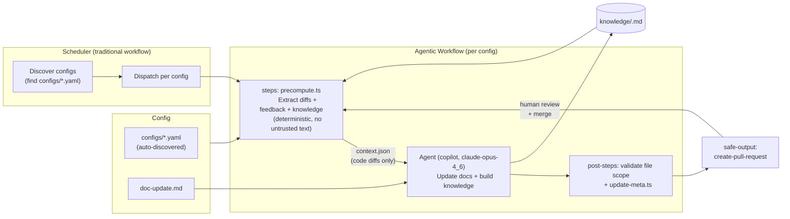

# Doc-Updater Pipeline

## Security Model

- **No untrusted text in agent context**: Review comments and commit messages
  are excluded from `context.json`. Only code diffs are passed to the agent.
- **File scope enforced by post-step**: The agent has full shell and edit
  access, but the `validate file scope` post-step checks that only files
  within `allowedPaths` from the config were modified. Violations fail the run.
- **Write operations via safe outputs**: Pull requests are created only via the
  `create-pull-request` safe output, which sanitizes the output.
- **Network isolation**: The agent runs in a sandboxed container with
  restricted network access.
